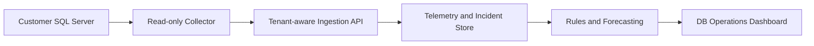

# MVP Architecture

## Product boundary

The MVP separates the future customer-side collector from the SaaS control plane. The current repository implements the interactive browser prototype and a safe example SQL health query.

## Core domains

| Domain | Responsibility |
| --- | --- |
| Identity | Users, organizations, roles, sessions |
| Inventory | SQL instances, environments, collector status |
| Telemetry | Time-series health metrics and availability state |
| Security | Policy checks, evidence, severity, remediation guidance |
| Incidents | Detection, assignment, status, timeline, resolution |
| Forecasting | Capacity baselines, projections, confidence, thresholds |
| Audit | User and system actions with tenant and timestamp |

## Tenant isolation

Every durable domain record must contain an immutable `organization_id`. API authorization resolves the caller's organization memberships and applies organization scope server-side. Client-supplied organization identifiers are never trusted by themselves.

## Collector trust model

- Outbound TLS connection from the customer environment.
- Short-lived or rotatable collector credentials.
- Read-only SQL permissions limited to required DMVs and metadata.
- Allowlisted queries with timeouts and sampling controls.
- Local redaction before telemetry leaves the environment.
- No remote command execution in the MVP.

## Recommended implementation phases

1. **Prototype:** static SaaS workflow and synthetic telemetry (this repository).
2. **Connected lab:** collector + API against a disposable SQL Server 2022 container.
3. **Secure multi-tenancy:** OIDC, RBAC, PostgreSQL row-level security, audit trails.
4. **Evaluation:** incident detection accuracy, forecast error, time-to-diagnosis, usability, and overhead.
5. **Controlled automation:** separate approval workflow, signed playbooks, rollback and evidence capture.
